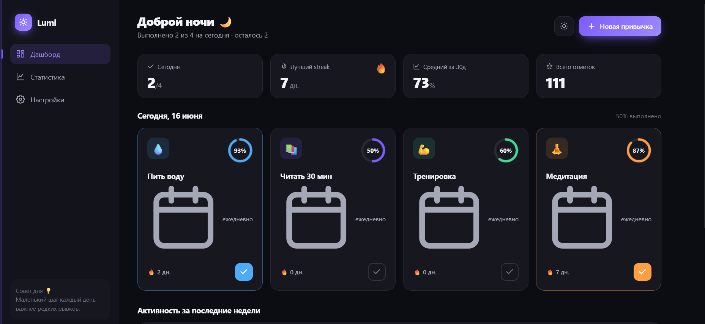
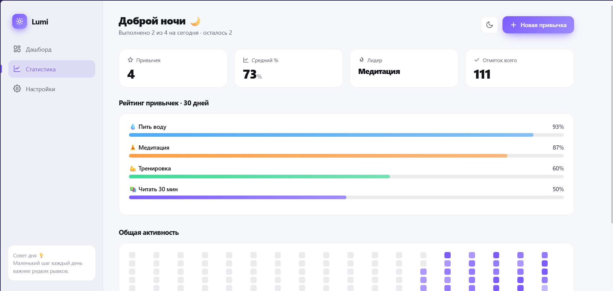
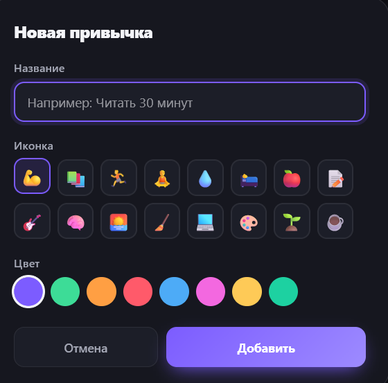
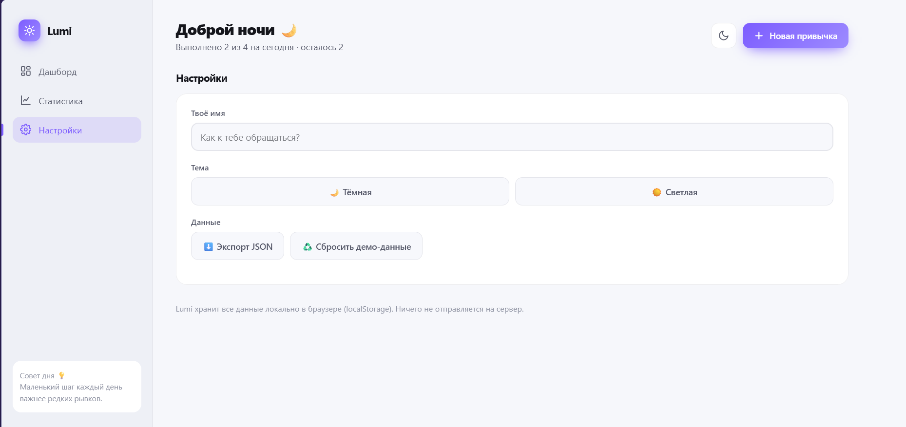

# 🎨 Lumi — Habit & Goals Dashboard

> Красивый, отзывчивый веб-дашборд для трекинга привычек. Фокус на UI/UX: анимации, микро-взаимодействия, тёмная/светлая темы. Без зависимостей — чистый HTML/CSS/JS.

**🔗 Live demo:** (https://txltedxgod.github.io/lumi/)_
---

## 📸 Скриншоты

| Дашборд — тёмная тема | Дашборд — светлая тема |
| --- | --- |
|  |  |

| Новая привычка | Настройки |
| --- | --- |
|  |  |

---

## ✨ Возможности

- 📊 **Дашборд** — карточки привычек с круговыми прогресс-индикаторами и сводкой дня
- 🔥 **Streaks** — серии дней подряд с анимацией
- 🟪 **Heatmap активности** — как контрибьюшены на GitHub
- 📈 **Статистика** — рейтинг привычек, проценты выполнения, графики по неделям
- 🌗 **Тёмная и светлая темы** с плавным переходом
- ➕ **CRUD привычек** — добавление, редактирование, удаление с выбором иконки и цвета
- 🎉 **Конфетти** при выполнении всех привычек за день
- ✅ **Микро-взаимодействия** — анимация отметок, hover-эффекты, toast-уведомления
- 📱 **Полная адаптивность** (mobile-first, нижняя навигация на мобильных)
- 💾 **Хранение в localStorage** — данные не уходят на сервер
- ⬇️ **Экспорт данных** в JSON

## 🛠 Стек

| Слой | Технология |
| --- | --- |
| Разметка | HTML5 (семантическая) |
| Стили | CSS-переменные, Grid/Flexbox, `color-mix()`, keyframe-анимации |
| Логика | Vanilla JavaScript (ES6+), без фреймворков и сборки |
| Хранение | localStorage |
| Графика | Инлайновый SVG (прогресс-кольца), Canvas (конфетти) |

> Проект намеренно сделан без зависимостей, чтобы открываться двойным кликом и мгновенно деплоиться. Архитектура легко переносится на **Next.js + Tailwind + Framer Motion** как следующий шаг.

## 🚀 Запуск

```bash
# Просто открой index.html в браузере
open index.html

# или подними локальный сервер
python3 -m http.server 8000
# затем открой http://localhost:8000
```

## 📦 Деплой

**Vercel / Netlify:** перетащи папку — статический сайт задеплоится без настройки.

**GitHub Pages:** Settings → Pages → Branch: `main` / root.

## 📂 Структура

```
lumi/
├── index.html   # разметка + дизайн-система (CSS)
├── app.js       # состояние, рендеринг, взаимодействия
└── README.md
```

## 🧭 Дальнейшее развитие

- [ ] Перенос на Next.js + TypeScript + Tailwind
- [ ] Напоминания и уведомления
- [ ] Синхронизация через Supabase
- [ ] PWA + офлайн-режим

---

_Сделано как portfolio-проект для демонстрации навыков фронтенда и UI/UX._
